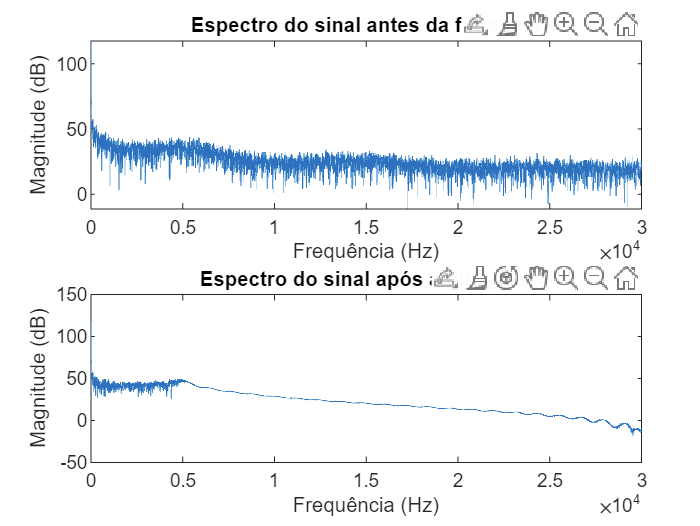

# Descrição do projeto

Este projeto consiste na leitura de um sinal de pressão de um sistema de filtragem e na aplicação de um filtro passa-baixa FIR. Em seguida, é plotado o espectro do sinal antes e depois da filtragem.

## Sinal de entrada

O sinal de entrada é um conjunto de medições da pressão na saída do filtro ao longo do tempo, armazenado em um arquivo CSV. O sinal foi amostrado a uma frequência de 50 kHz.

## Transformada de Fourier

A transformada de Fourier é uma técnica para analisar sinais no domínio da frequência. Ela converte um sinal no domínio do tempo em suas componentes de frequência. A amplitude de cada componente de frequência indica o quanto essa frequência está presente no sinal. A transformada de Fourier é usada para visualizar o espectro de frequência do sinal antes e depois da filtragem.

## Filtro passa-baixa FIR

Um filtro passa-baixa é um filtro que permite que as frequências abaixo de uma frequência de corte passem sem atenuação, e atenua as frequências acima da frequência de corte. Um filtro passa-baixa FIR é um filtro digital que é implementado por meio de uma convolução com um sinal de entrada. O filtro usado neste projeto tem frequência de corte de 5 kHz e ordem de 101.

## Resultados

O código `filter_script.m` lê o sinal de entrada e aplica o filtro passa-baixa FIR. Em seguida, plota o espectro do sinal antes e depois da filtragem.



O gráfico acima mostra o espectro do sinal antes e depois da filtragem. As unidades da amplitude são arbitrários. As linhas verticais indicam as frequências de corte do filtro. Como pode ser observado, o filtro atenua as frequências acima de 5 kHz, mantendo as frequências abaixo dessa frequência.
## Funcionamento do codigo
```
% Leitura dos dados a partir do arquivo CSV
filename = 'hex.csv';
data = readtable(filename);
data(isnan(data.OutletPressure), :) = [];
```

Essas linhas carregam os dados de um arquivo CSV chamado "hex.csv" e armazenam esses dados na variável data. A última linha remove todas as linhas em que a coluna "OutletPressure" contém um valor NaN (não numérico).

```
% Definição das frequências de corte e de amostragem
Fc = 5000;  % frequência de corte
Fs = 60000; % frequência de amostragem
```
Essas linhas definem a frequência de corte (Fc) e a frequência de amostragem (Fs) do filtro digital que será aplicado posteriormente.

```
% Cálculo da frequência angular de corte
wc = 2*pi*Fc/Fs;
```

Essa linha calcula a frequência angular de corte (wc) em radianos por segundo usando a fórmula wc = 2*pi*Fc/Fs.

```
% Cálculo dos coeficientes do filtro FIR
M = 50;
h0 = wc/pi;
n1 = [1:M];
n2 = [-M:-1];
hn_pos = (1./(pi*n1)).*sin(wc*n1);
hn_neg = (1./(pi*n2)).*sin(wc*n2);
hn = [hn_neg h0 hn_pos];
```

Essas linhas calculam os coeficientes do filtro digital FIR (resposta ao impulso finita) que será aplicado posteriormente. O filtro é projetado para ter uma resposta em frequência passa-baixa com frequência de corte em Fc. O parâmetro M define o comprimento do filtro (ou seja, o número de coeficientes), que neste caso é 50. A resposta ao impulso do filtro é simétrica, então os coeficientes positivos e negativos são calculados separadamente e, em seguida, combinados em um único vetor hn.

```matlab
% Aplicação do filtro ao sinal de entrada
filtered_data = conv(data.OutletTemperature, hn, 'same');
```
Esta linha aplica o filtro digital FIR (hn) ao sinal de entrada (data.OutletTemperature) usando a função conv. A opção 'same' faz com que a saída tenha o mesmo comprimento que a entrada.

```matlab
Copy code
% Cálculo e plot do espectro do sinal antes e depois da filtragem
N = length(data.OutletTemperature);
f = Fs*(0:N-1)/N;
f = f(1:N/2+1); % considera apenas a metade do espectro
X = fft(data.OutletTemperature, N);
X = abs(X(1:N/2+1));
X = 20*log10(X);
Y = fft(filtered_data, N);
Y = abs(Y(1:N/2+1));
Y = 20*log10(Y);
subplot(2, 1, 1);
plot(f, X);
title('Espectro do sinal antes da filtragem');
xlabel('Frequência (Hz)');
ylabel('Magnitude (dB)');
subplot(2, 1, 2);
plot(f, Y);
title('Espectro do sinal após a filtragem');
xlabel('Frequência (Hz)');
ylabel('Magnitude (dB)');
```
## Requisitos de software

- MATLAB (versão R2020a ou superior)

## Como usar

1. Abra o MATLAB.
2. Navegue até o diretório onde os arquivos do projeto estão localizados.
3. Digite `filter_script` na linha de comando do MATLAB para executar o script.
4. Aguarde até que o script termine a execução. O gráfico do espectro do sinal antes e depois da filtragem será mostrado na janela de gráficos do MATLAB.
